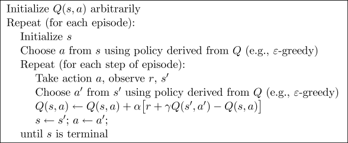

<h1> Cliff Walking: A Case Study to Compare Sarsa and Q-Learning</h1>

 C. Vic Hu

	<h3> Introduction </h3>
	

		Adapting Example 6.6 from Sutton & Barto's Reinforcement Learning textbook, this work focuses on recreating the cliff walking experiment with Sarsa and Q-Learning algorithms and extends the study to observe how the results differ when choosing different parameters and world dimensions. 	
	

	
 
		
		 
		Cropped from the original figure in the textbook, the figure above illustrates the world of Cliff Walking, which consists of a two dimensional grids with the start on the left bottom, goal on the left bottom, and cliff at the bottom between the start and the goal. The agent is rewarded -1 for each step taken and -100 if ends up at any of the cliff states, which brings the agent back to the start. In the original example, the author chooses eta = 0.1 for eta-greedy Sarsa and Q-Learning, but didn't specify which alpha and gamma were used. In this work, we wish to experiment with various learning parameters such as eta (exploration), gamma (discount rate) and alpha (step size) and see how they affect the learning performance.
	

	<h3> Methods </h3>
	

		Given the Cliff Walking grid world described above, we use one on-policy TD control algorithm, Sarsa, and another off-policy TD control algorithm, Q-Learning, to learn the optimal strategy to traverse from the start to the goal. As a quick reminder, the Sarsa control algorithm goes as following:
		 
		 
		
		 
		 
		And the Q-Learning control algorithm:
		 
		 
		
		 
		 
		
	

	<h3> Results </h3>
	

		
	

	<h3> Conclusion </h3>
	

		
	

