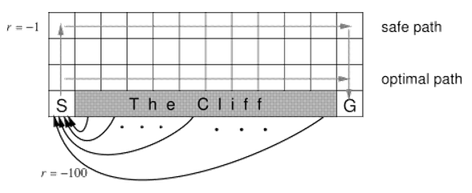
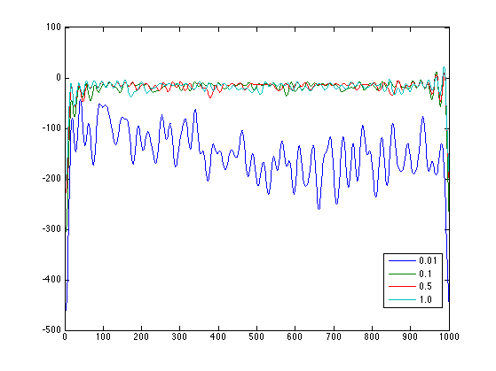
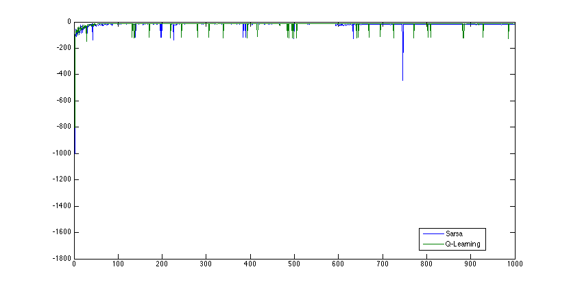
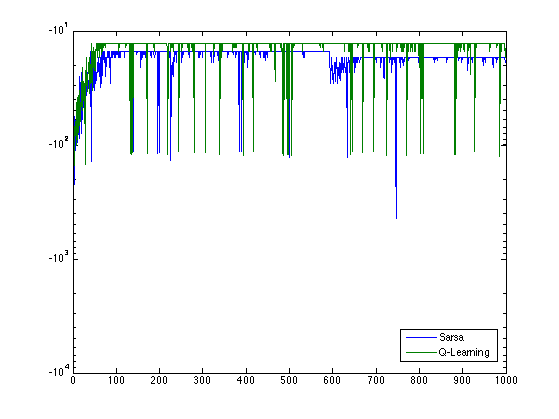

<h1> Cliff Walking: A Case Study to Compare Sarsa and Q-Learning</h1>

 C. Vic Hu

	<h3> Introduction </h3>
	

		Adapting Example 6.6 from Sutton & Barto's Reinforcement Learning textbook, this work focuses on recreating the cliff walking experiment with Sarsa and Q-Learning algorithms and extends the study to observe how the results differ when choosing different parameters and world dimensions. 	
	

	
 
		
		 
		Cropped from the original figure in the textbook, the figure above illustrates the world of Cliff Walking, which consists of a two dimensional grids with the start on the left bottom, goal on the left bottom, and cliff at the bottom between the start and the goal. The agent is rewarded -1 for each step taken and -100 if ends up at any of the cliff states, which brings the agent back to the start. In the original example, the author chooses eta = 0.1 for eta-greedy Sarsa and Q-Learning, but didn't specify which alpha and gamma were used. In this work, we wish to experiment with various learning parameters such as eta (exploration), gamma (discount rate) and alpha (step size) and see how they affect the learning performance.
	

	<h3> Methods </h3>
	

		Given the Cliff Walking grid world described above, we use one on-policy TD control algorithm, Sarsa, and another off-policy TD control algorithm, Q-Learning, to learn the optimal strategy to traverse from the start to the goal. As a quick reminder, the Sarsa control algorithm goes as following:
		 
		 
		
		 
		 
		And the Q-Learning control algorithm:
		 
		 
		
		 
		 
		For each algorithm, we run the Cliff Walking process for a thousand espisodes and plot the learning curve as the reward obtained per episodes. We compare how different learning parameters affect the learning curve by experimenting a set of eta (exploration in soft-greedy), alpha (step size) and gamma (discount factor) and observing how the learning curves change. We then pick the best set of parameters of both Sarsa and Q-Learning to compete with each other. All the experiments so far are performed on the default 12x4 grid world. Finally, we visualize the optimal policy by both algorithms on various dimensions of the CliffWalking world.
	

	<h3> Results </h3>
	

		For each of the figures below, the x axis is the number of episodes, and the y axis is the reward per episode. The left column is the original learning curve, while the right column is the smoothed curve (using FFT to remove higher frequency, see smooth.m for details.), except for the last row, in which the right column is the same curve in log(y) scale. Note that the smoothed figures usually have <a href="http://en.wikipedia.org/wiki/Gibbs_phenomenon"> Gibbs phenomenon</a> on the curve edges.
	

	

		<b>Various alpha on Sarsa, with eta fixed at 0.1, gamma fixed at 1.0:</b>
		 
		
		
		 
		We choose alpha=0.5 as the best learning curve and advance to the next round.
	

	

		<b>Various eta on Sarsa, with alpha fixed at 0.5, gamma fixed at 1.0:</b>
		 
		
		
		 
		We choose eta=0.01 as the best learning curve and advance to the next round.
	

	

		<b>Various gamma on Sarsa, with eta fixed at 0.01, alpha fixed at 0.5:</b>
		 
			
		 
		We choose gamma=0.5 as the best learning curve. In conclusion, our best parameters for Sarsa is alpha=0.5, gamma=0.5 and eta=0.01
	

	

		<b>Various alpha on Q-Learning, with eta fixed at 0.1, gamma fixed at 1.0:</b>
		 
		
		
		 
		We choose alpha=0.5 as the best learning curve and advance to the next round.
	

	

		<b>Various eta on Q-Learning, with alpha fixed at 0.5, gamma fixed at 1.0:</b>
		 
		
		
		 
		We choose eta=0.01 as the best learning curve and advance to the next round.
	

	

		<b>Various gamma on Q-Learning, with eta fixed at 0.01, alpha fixed at 0.5:</b>
		 
		
		
		 
		We choose gamma=0.5 as the best learning curve.
		In conclusion, our best parameters for Q-Learning is alpha=0.5, gamma=1.0 and eta=0.01
	

	

		<b>Now, we compare our best Sarsa with the best Q-Learning:</b>
		 
		
		
		 
		We can see that Q-Learning actually outperforms Sarsa in this case, as opposed to the other way around covered in the textbook. This is mainly due to the small exploration parameter eta=0.01 we choose, compared to the larger eta=0.1 used by the textbook, in which case the more conservative Sarsa outperforms Q-Learning.
	

	

	Next, we illustrate the optimal policy obtained by Sarsa and Q-Learning in various dimensions (u:up, d:down, r:right, l:left):
<pre>
12x4
Sarsa
.____________.
|            |
|rrrrrrrrrrrd|
|u          d|
|u           |
.____________.
Q-Learning
.____________.
|            |
|            |
|rrrrrrrrrrrd|
|u           |
.____________.

4x6
Sarsa
.____.
|    |
|    |
|    |
|rrd |
|u rd|
|u   |
.____.
Q-Learning
.____.
|    |
|    |
|    |
|    |
|rrrd|
|u   |
.____.

3x6
Sarsa
.___.
|   |
|   |
|   |
|rd |
|urd|
|u  |
.___.
Q-Learning
.___.
|   |
|   |
|   |
|   |
|rrd|
|u  |
.___.
</pre>
As expected, Sarsa is generally more conservative in that it always goes up at least one level than the policy of Q-Learning. However, instead of going all the way to the top row, Sarsa only goes two levels above the cliff, which is most likely due to our small eta (lower chance of risky exploration.)
	

	<h3> Conclusion </h3>
	

		In this work, we recreate the CliffWalking task as described in Example 6.6 of the textbook, compare various learning parameters and find the optimal setup of Sarsa and Q-Learning, and illustrate the optimal policy found by both algorithms in various dimensions. We find that with a small enough eta (0.01), Q-Learning actually outperforms Sarsa in the CliffWalking process.
	

